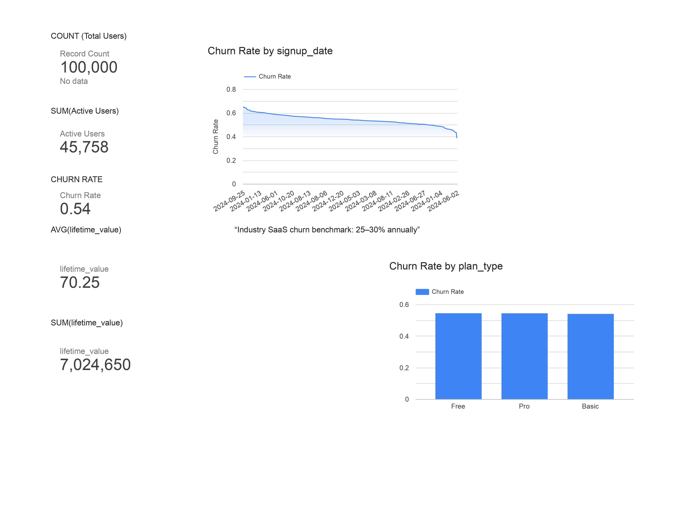
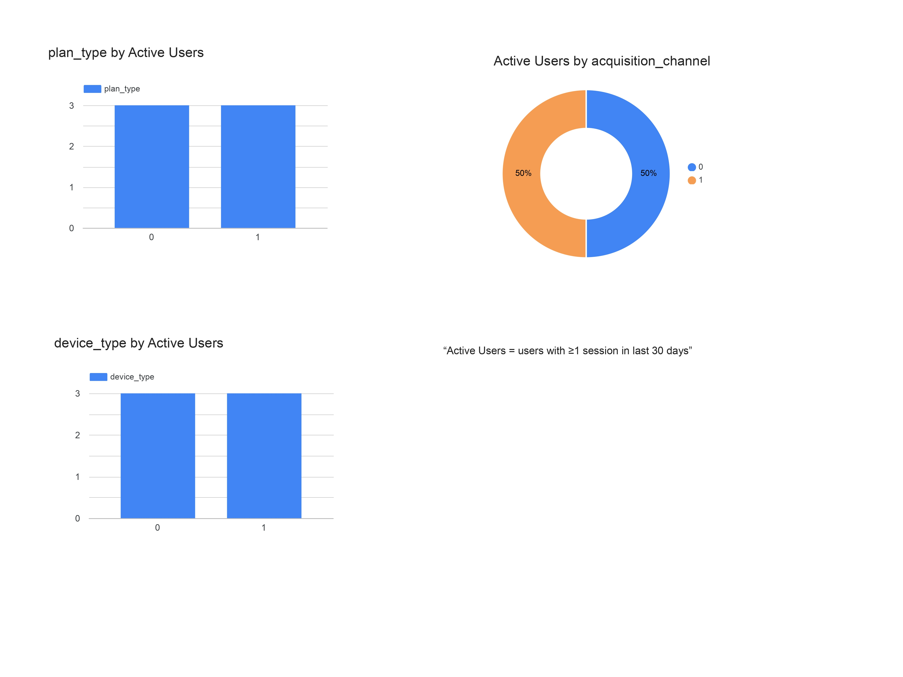
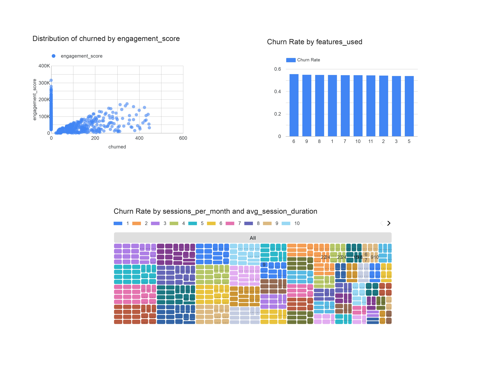
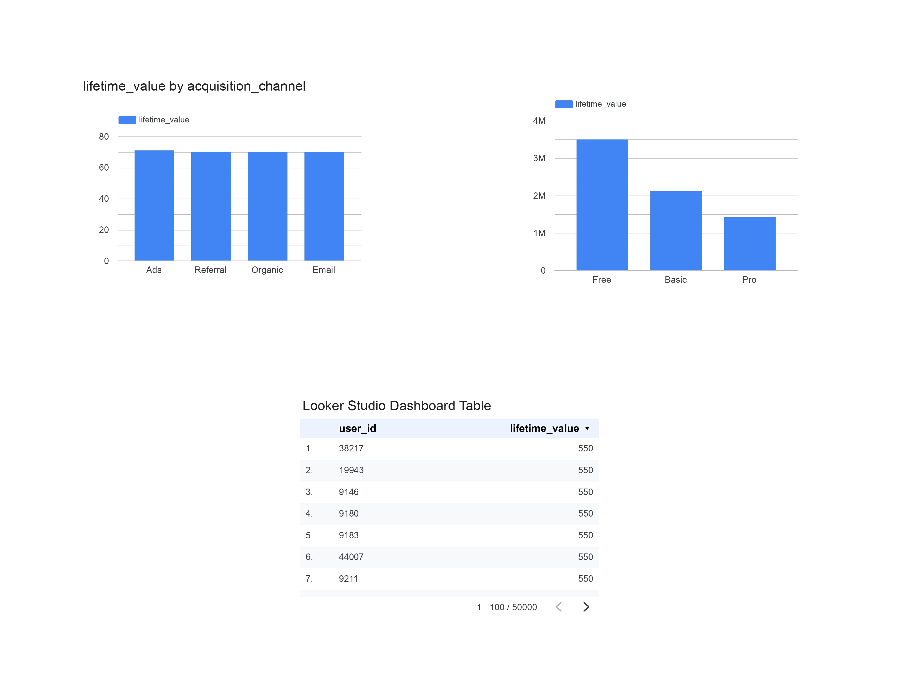

# 📊 Looker Studio Dashboard Structure  
## Subscription Churn & Retention Analysis

This document outlines the structure, metrics, and design rationale of the Looker Studio dashboard used in this project.  
The dashboard is designed to mirror **Google-style executive analytics dashboards**, focusing on clarity, actionability, and business impact.

---

## 🎯 Dashboard Objective
Provide a single source of truth for:
- Monitoring user churn and retention trends
- Identifying behavioral churn drivers
- Quantifying revenue and lifetime value impact
- Supporting product, growth, and support decision-making

---

## 🧱 Dashboard Pages & Components

---

## 📄 Page 1: Executive Overview

### Purpose
Give leadership a **high-level snapshot** of product health and retention performance.

### KPI Cards
| Metric | Description |
|------|------------|
| Total Users | Total number of registered users |
| Active Users | Users with at least one session in the last 30 days |
| Churn Rate | Percentage of users who churned |
| Avg LTV ($) | Average lifetime value per user |
| Total Revenue ($) | Total lifetime revenue generated |

### Visuals
- **Time Series:** Monthly Churn Rate Trend  
  - Dimension: `signup_date_parsed`
  - Metric: `churn_rate`

### Key Questions Answered
- Is churn improving or worsening over time?
- How healthy is the overall user base?

### Executive Overview
This view provides a leadership-level snapshot of overall product health, including total users, active users, churn rate, and lifetime value.

---

## 📄 Page 2: Churn Drivers & Segmentation

### Purpose
Diagnose **why users churn** by breaking behavior into segments.

### Charts
1. **Churn Rate by Plan Type**
   - Dimension: `plan_type`
   - Metric: `churn_rate`

2. **Churn Rate by Engagement Level**
   - Engagement Buckets:
     - Low: `< 40`
     - Medium: `40–70`
     - High: `> 70`

3. **Churn by Support Tickets**
   - Dimension: `support_tickets`
   - Metric: `churn_rate`

### Key Questions Answered
- Which plans churn the most?
- How strongly does engagement influence churn?
- Does customer support interaction correlate with churn?

## 📸 Dashboard Screenshots

### Churn Drivers & Segmentation
This section breaks down churn by subscription plan, engagement level, and customer support interactions to identify high-risk user segments.

---

## 📄 Page 3: Engagement & Retention Analysis

### Purpose
Understand **user behavior patterns** that lead to retention or churn.

### Charts
- **Scatter Plot:** Engagement Score vs Churn Rate
- **Bar Chart:** Sessions per Month vs Churn Rate
- **Time Series:** Monthly Active Users (MAU)

### Key Questions Answered
- What engagement threshold predicts churn?
- How does usage frequency relate to retention?

### Engagement & Retention Analysis
Visualizes how user engagement and product usage correlate with churn and retention trends over time.

---

## 📄 Page 4: Revenue & Lifetime Value Impact

### Purpose
Translate churn into **financial impact** for leadership.

### Charts
1. **Avg LTV by Plan Type**
2. **Revenue Lost Due to Churn**
3. **LTV by Engagement Bucket**

### Key Questions Answered
- Which segments generate the most value?
- How much revenue is at risk due to churn?
- Which users should be prioritized for retention?

### Revenue & Lifetime Value Impact
Translates churn into financial impact by highlighting revenue at risk and lifetime value distribution across segments.

---

## 🧠 Metric Definitions (Data Governance)

| Metric | Definition |
|------|-----------|
| Churn Rate | Churned users ÷ total users |
| Active User | User with ≥1 session in last 30 days |
| Engagement Score | Composite metric based on usage frequency |
| Lifetime Value | Total revenue generated per user |
| Revenue at Risk | Sum of LTV for churned users |

---

## 🎨 Design Principles
- Minimal color palette (Google-style clarity)
- Top-to-bottom storytelling flow
- KPI → Trend → Driver → Impact → Action
- No redundant metrics
- Clear labeling and definitions

---

## 📌 Business Recommendations Section
Each dashboard page includes a **text insight box** summarizing:
- Key observation
- Business implication
- Recommended action

Example:
> “Low-engagement Basic plan users show 2× higher churn, indicating onboarding optimization as the highest-impact intervention.”

---

## 🔗 Dashboard Link
https://lookerstudio.google.com/reporting/93611903-909c-4e57-ac88-63cd6c8a9a8e

---

## ✅ Recruiter Signal
This dashboard demonstrates:
- Executive-level metric thinking
- Strong data modeling
- Business-first storytelling
- Practical decision support

Designed to align with **Google Data Analyst and Product Analytics expectations**.
